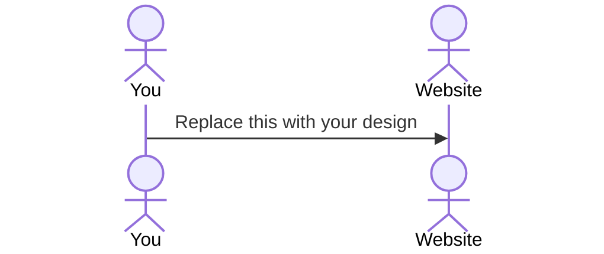

# Bounty Hunter

[My Notes](notes.md)

This is a site for people to put in rfps to find the music they are looking for and collaborate with otherwise unknown content creators. Ex: "I need some original music for my youtube video". go to the site and request what you want. there will then be a sub competition to fulfil the request.

> [!NOTE]
>  This is a template for your startup application. You must modify this `README.md` file for each phase of your development. You only need to fill in the section for each deliverable when that deliverable is submitted in Canvas. Without completing the section for a deliverable, the TA will not know what to look for when grading your submission. Feel free to add additional information to each deliverable description, but make sure you at least have the list of rubric items and a description of what you did for each item.

> [!NOTE]
>  If you are not familiar with Markdown then you should review the [documentation](https://docs.github.com/en/get-started/writing-on-github/getting-started-with-writing-and-formatting-on-github/basic-writing-and-formatting-syntax) before continuing.

## 🚀 Specification Deliverable

> [!NOTE]
>  Fill in this sections as the submission artifact for this deliverable. You can refer to this [example](https://github.com/webprogramming260/startup-example/blob/main/README.md) for inspiration.

For this deliverable I did the following. I checked the box `[x]` and added a description for things I completed.

- [x] Proper use of Markdown
- [x] A concise and compelling elevator pitch
- [ ] Description of key features
- [x] Description of how you will use each technology
- [ ] One or more rough sketches of your application. Images must be embedded in this file using Markdown image references.

### Elevator pitch

There are many music libraries and sites out there to find music for your video or commercial or whatever, but what if you could get a song tailor made to what you want? even better what if you could get many such songs and choose the best one? That is what Bounty hunter aims to do with the way it is.

### Design

Lorem ipsum dolor sit amet, consectetur adipiscing elit, sed do eiusmod tempor incididunt ut labore et dolore magna aliqua. Ut enim ad minim veniam, quis nostrud exercitation ullamco laboris nisi ut aliquip ex ea commodo consequat. Duis aute irure dolor in reprehenderit in voluptate velit esse cillum dolore eu fugiat nulla pariatur. Excepteur sint occaecat cupidatat non proident, sunt in culpa qui officia deserunt mollit anim id est laborum.

### Key features

* Request & Contest Features
  
⋅⋅⋅Music Request Form: Filmmakers and YouTubers post detailed requests specifying their needs (genre, mood, length, intended use).
  
⋅⋅⋅Bounty/Contest Creation: Each request becomes a contest (“bounty”) that composers can enter by submitting original tracks.
  
⋅⋅⋅Submission Gallery: Creators view and compare all contest entries, with options to preview, filter, and sort submissions.

* Collaboration & Engagement
⋅⋅⋅Messaging & Feedback: Built-in chat or comment tools allow real-time discussion, feedback, and iteration between requester and musicians.

⋅⋅⋅Contest Voting/Judging: Requesters (and optionally the community) can vote or rate submissions, increasing engagement and encouraging creators.

⋅⋅⋅Profile Pages: Every user—requester or musician—has a profile with contest history, wins, and sample works.

* Platform Tools
⋅⋅⋅Authentication/Login: Secure login system for user data, submissions, and rewards tracking.

⋅⋅⋅Notifications: Real-time alerts (via WebSocket) about contest updates, new messages, and bounty results to keep users engaged.

⋅⋅⋅Search & Discovery: Browse open bounties, filter by genre or popularity, and search for composers or recent winners.

* Licensing, Payments & Security
⋅⋅⋅Transparent Licensing: Simple, clear agreement on song usage rights once a track is selected, protecting both content creator and musician.

⋅⋅⋅Reward/Payment System: Direct payment for contest winners (using platform credits, paypal, etc.), with administration for taxes and royalties if needed.

⋅⋅⋅Data Security: Secure storage and transfer of tracks, user data, and payments.

* Community & Promotion
⋅⋅⋅Public Playlists: Showcase winning tracks and featured contests to promote creators and inspire new requests.

⋅⋅⋅Leaderboard/Statistics: Track top contributors, contest success rates, and trending musical styles to motivate users.

### Technologies

I am going to use the required technologies in the following ways.

- **HTML** - Uses correct HTML structure for application. Five HTML pages. Request songs page, search for bounties page, login page, contest page, profile page. Hyperlinks to choice artifact.
- **CSS** - Application styling that looks good on different screen sizes, uses good whitespace, color choice and contrast.
- **React** - Implement the login system and input forms using React components (e.g., user authentication, contest entry, song request forms). Display dynamic choices such as contest submissions, selectable winner, and bounty filters with React state management.
- **Service** - Backend service with endpoints for:
⋅⋅⋅⋅* Create a new song request (RFP)
⋅⋅⋅⋅* List/search existing bounties
⋅⋅⋅⋅* Submit a track to a bounty’s contest
⋅⋅⋅⋅* View entries for a bounty
⋅⋅⋅⋅* Handle authentication
⋅⋅⋅⋅* Fetch user profile, recent submissions, win history

- **DB/Login** - Store users (authentication, roles), bounty requests, contest submissions, selected winners, profile info.
- **WebSocket** - Enable real-time notifications (e.g., new bounty posted, contest updates, winner announcements). Use WebSocket for live collaboration features—artists and requesters can chat, provide feedback, and track contest status as it happens.

## 🚀 AWS deliverable

For this deliverable I did the following. I checked the box `[x]` and added a description for things I completed.

- [ ] **Server deployed and accessible with custom domain name** - [My server link](https://yourdomainnamehere.click).

## 🚀 HTML deliverable

For this deliverable I did the following. I checked the box `[x]` and added a description for things I completed.

- [ ] **HTML pages** - I did not complete this part of the deliverable.
- [ ] **Proper HTML element usage** - I did not complete this part of the deliverable.
- [ ] **Links** - I did not complete this part of the deliverable.
- [ ] **Text** - I did not complete this part of the deliverable.
- [ ] **3rd party API placeholder** - I did not complete this part of the deliverable.
- [ ] **Images** - I did not complete this part of the deliverable.
- [ ] **Login placeholder** - I did not complete this part of the deliverable.
- [ ] **DB data placeholder** - I did not complete this part of the deliverable.
- [ ] **WebSocket placeholder** - I did not complete this part of the deliverable.

## 🚀 CSS deliverable

For this deliverable I did the following. I checked the box `[x]` and added a description for things I completed.

- [ ] **Header, footer, and main content body** - I did not complete this part of the deliverable.
- [ ] **Navigation elements** - I did not complete this part of the deliverable.
- [ ] **Responsive to window resizing** - I did not complete this part of the deliverable.
- [ ] **Application elements** - I did not complete this part of the deliverable.
- [ ] **Application text content** - I did not complete this part of the deliverable.
- [ ] **Application images** - I did not complete this part of the deliverable.

## 🚀 React part 1: Routing deliverable

For this deliverable I did the following. I checked the box `[x]` and added a description for things I completed.

- [ ] **Bundled using Vite** - I did not complete this part of the deliverable.
- [ ] **Components** - I did not complete this part of the deliverable.
- [ ] **Router** - I did not complete this part of the deliverable.

## 🚀 React part 2: Reactivity deliverable

For this deliverable I did the following. I checked the box `[x]` and added a description for things I completed.

- [ ] **All functionality implemented or mocked out** - I did not complete this part of the deliverable.
- [ ] **Hooks** - I did not complete this part of the deliverable.

## 🚀 Service deliverable

For this deliverable I did the following. I checked the box `[x]` and added a description for things I completed.

- [ ] **Node.js/Express HTTP service** - I did not complete this part of the deliverable.
- [ ] **Static middleware for frontend** - I did not complete this part of the deliverable.
- [ ] **Calls to third party endpoints** - I did not complete this part of the deliverable.
- [ ] **Backend service endpoints** - I did not complete this part of the deliverable.
- [ ] **Frontend calls service endpoints** - I did not complete this part of the deliverable.
- [ ] **Supports registration, login, logout, and restricted endpoint** - I did not complete this part of the deliverable.

## 🚀 DB deliverable

For this deliverable I did the following. I checked the box `[x]` and added a description for things I completed.

- [ ] **Stores data in MongoDB** - I did not complete this part of the deliverable.
- [ ] **Stores credentials in MongoDB** - I did not complete this part of the deliverable.

## 🚀 WebSocket deliverable

For this deliverable I did the following. I checked the box `[x]` and added a description for things I completed.

- [ ] **Backend listens for WebSocket connection** - I did not complete this part of the deliverable.
- [ ] **Frontend makes WebSocket connection** - I did not complete this part of the deliverable.
- [ ] **Data sent over WebSocket connection** - I did not complete this part of the deliverable.
- [ ] **WebSocket data displayed** - I did not complete this part of the deliverable.
- [ ] **Application is fully functional** - I did not complete this part of the deliverable.
